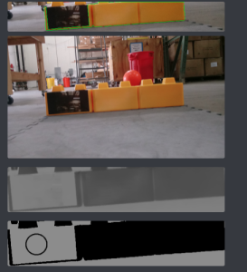

**SKYSTONE_CV**. 

This detector returns the pixel location of the left most boundary of the black target. 
You can easily modify it to get you the center. 
It is your job to determine what you want to do with this value.
The methods you care about are 
`VisionPipline#process` and `VisionPipline#getVumarkLeftBoundary`

It is unlikely that this detector works flawlessy out of the box without you tuning some parameters such as contour area, width, ect. These parameters depend on you webcams placement so it is best to test these empirically. 

NOTE:
I am aware of an issue that occurs when the camera's view wobbles a lot and the blocks go out of frame. 
I am looking into a fix for this, but as long as your camera isn't flailing wildly you should be fine. 

If you see bugs, dm me on discord at Epsilon#0036, or drop an issue.

This detector focuses on versatility, not speed, so it is relatively heavy. Ideally, based on your webcam placement, you can remove some filters to increase framerate. 

Currently, I am using vuforia to get frames from the camera. This is not ideal and you should instead use EasyOpenCV which grabs frames natively. For various reasons I am not using it at the moment, but I recommend you try it out. 

